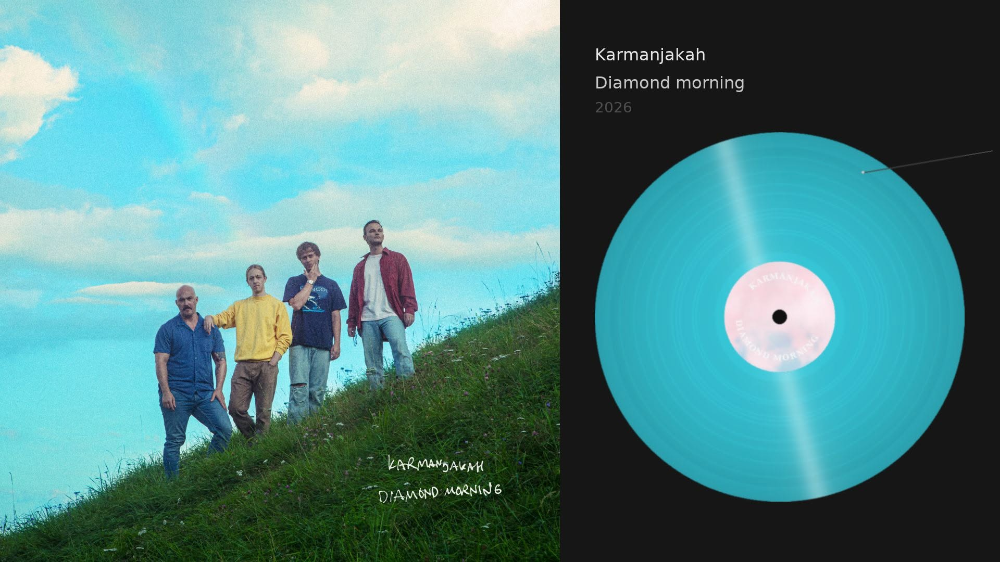
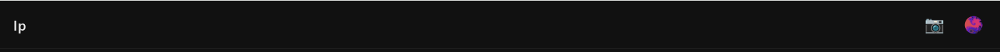
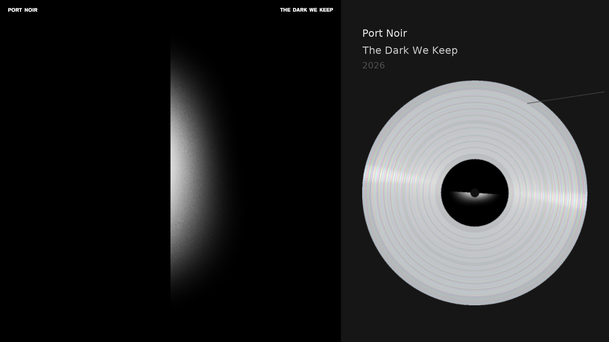
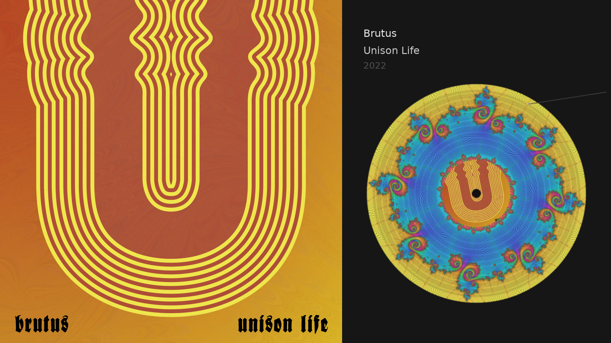
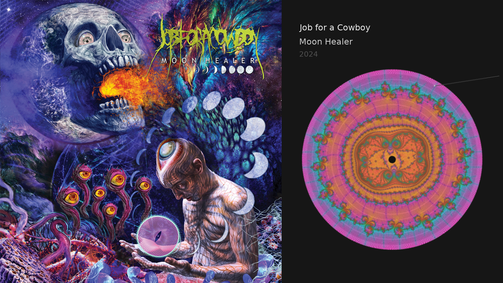

# lp

## karmanjakah



What lands in this release:

- **True gapless playback** — albums now cross track boundaries seamlessly. The next track is preloaded and the audio output is never torn down, so a reverb tail or ambient bed that flows from one track into the next no longer drops a blip at the seam.
- **New cyan colorway** — the disc in the shot above.
- **Glossy shine** — a fixed specular reflection that stays put as the record spins (the room light doesn't rotate with the disc).
- **Album labels with real text** — artist and album rendered curved around the spindle, with a font picker, color controls, and two layers of decor rings.
- **Unified vinyl picker** in the web UI — every style as a live thumbnail, sortable, with a collage editor for arranging them how you like.
- **Music Browser** — Artist grid editor, favorites and sorting.

---

### Stop changing tracks, stop switching playlists, stop making playlists. Good bands already make 'em, they call them albums. 

A music player that plays albums like a record player plays albums. Pygame renders a spinning vinyl and the album art on your display while a web UI lets you browse and control playback from your phone.

Touch-friendly web UI. Browse your library, tap an album, melt.

LastFM scrobbling so you know how long you were faded last night.

Take screenshots, the next 3 were taken with the new feature. Also improved is the look of the grooves on all the patterns.  





Better clear vinyl rendering with iridescent refraction and platter shimmer.



Ultra Deep-zoom Mandelbrot vinyls



Use any fractal pattern as the full vinyl, just like Picture Discs


Only one layer deep. Albums — select one and it plays.


Colored vinyl, fractals, nebulae, label colors, brightness. Make it yours.


Subtle grooves in the vinyl mark each track on the album.


Tracks are accurately marked. The needle follows the grooves as it plays.


A sensible night.


Get into the right headspace.


\m/

## Setup

```bash
python -m venv .venv
source .venv/bin/activate
pip install -r requirements.txt
cp config.example.yml config.yml
# Edit config.yml with your music library path
python main.py
```

The web UI is at `http://localhost:8000`. The pygame display runs on whatever screen the process is on.

## Config

```yaml
music_library_path: /path/to/music  # Artist/Album folder structure
display:
  fullscreen: false
  width: 1920
  height: 1080
lastfm:
  api_key: ""      # Optional, for scrobbling
  api_secret: ""
```

## Features

- Album playback via libVLC
- Pygame vinyl visualization with spinning record, needle, and track grooves
- Web UI for browsing and playback control
- Vinyl styles: black, colored, clear, picture disc, Mandelbrot fractals, nebulae
- Customizable label colors
- Last.fm scrobbling (authenticate from the web UI)

## Architecture

Meant to run on a Raspberry Pi connected to a TV or other display. The web UI is your remote.

```
main.py          Entry point
lp/
  player.py      VLC playback engine
  display.py     Pygame vinyl renderer
  library.py     Music library scanner
  api.py         FastAPI REST server + static files
  scrobbler.py   Last.fm integration
static/          Web UI
```

### Just play the damn record.

## Vinyl styles

Random per album: black, colored, clear (with platter shimmer + iridescent
refraction), picture disc, pattern picture disc (fractal as the full
disc), and three fractal families:

- **Mandelbrot** — classic escape-time fractal at named zooms (seahorse,
  elephant, spiral, etc.) across a dozen color schemes.
- **Nebula** — value-noise gas clouds in 19 color variants.
- **Munafo Deep-Zoom** — `2.7×10⁻²²` deep-zoom Mandelbrot renders. The
  9000×9000 gold archives + the GPU/perturbation engine that produced
  them live in a separate repo: **[bongsweat](https://github.com/dkoch84/bongsweat)**. The
  vinyl-size cache (`lp/cache/munafo/*.png`, ~14 MB) is committed here
  and consumed at runtime by `_draw_munafo_vinyl()` in `lp/display.py`.

Center labels follow the same families — any fractal variant can be
chosen as the label.
