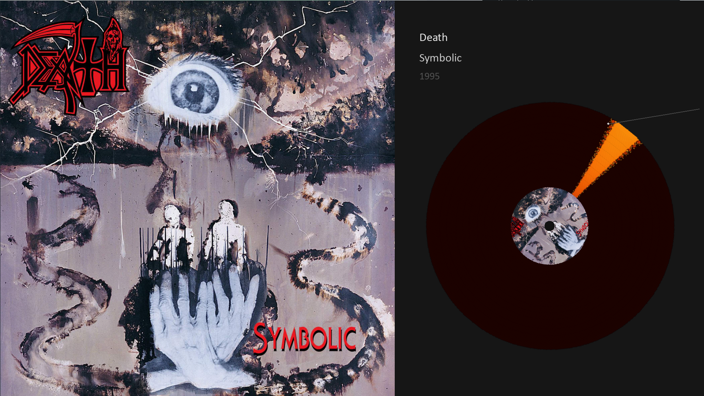
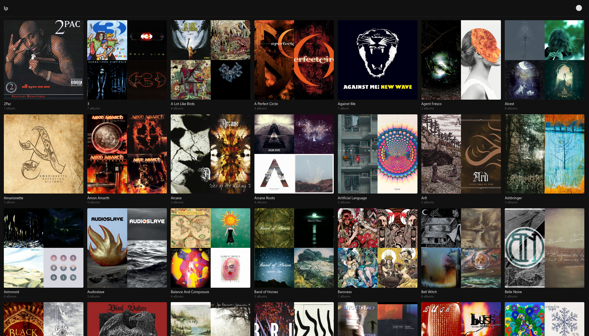
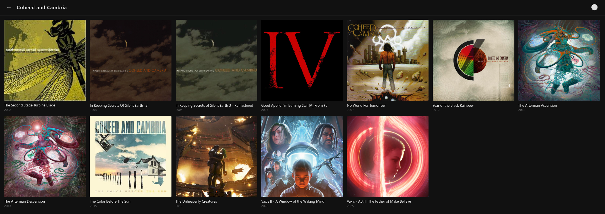
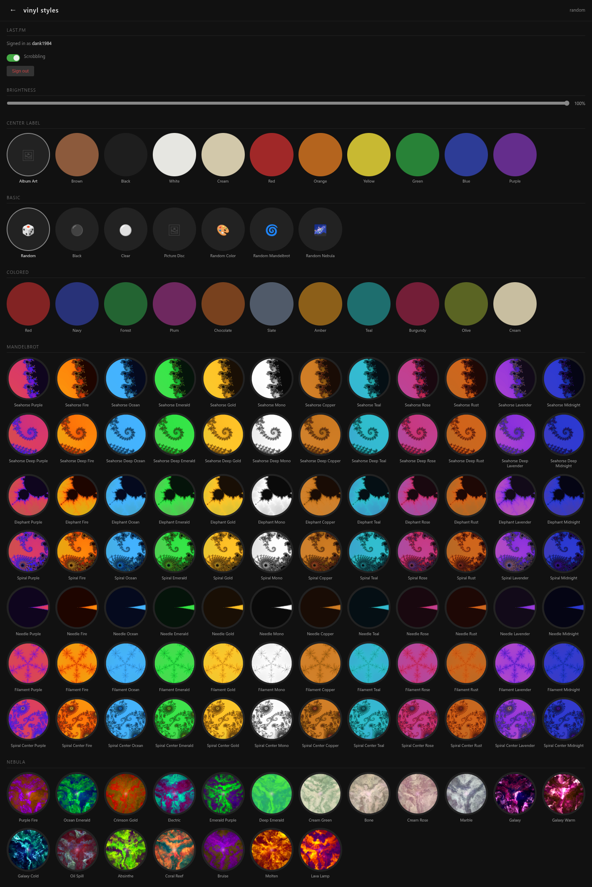
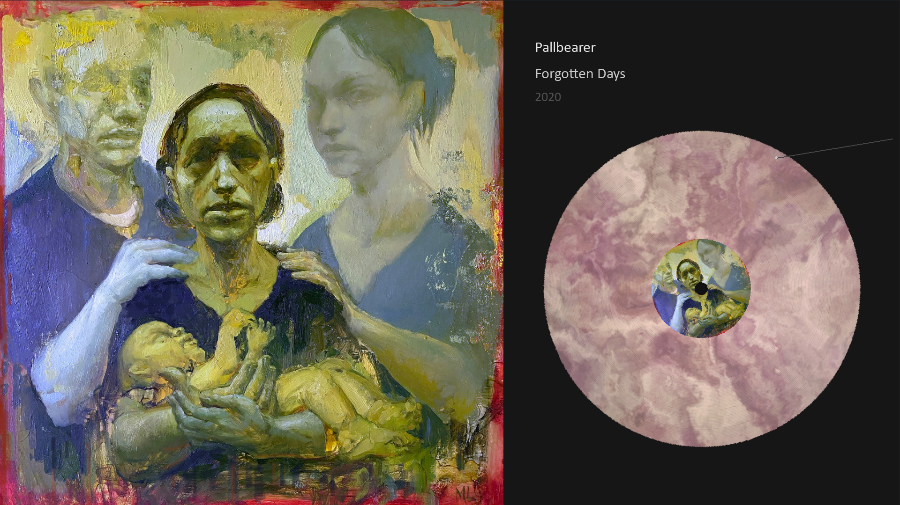
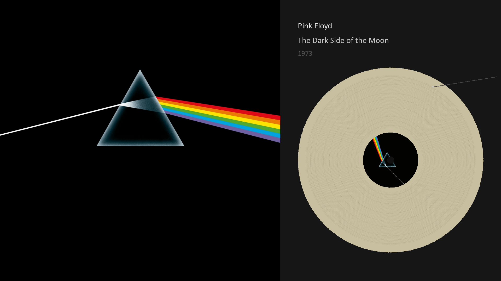
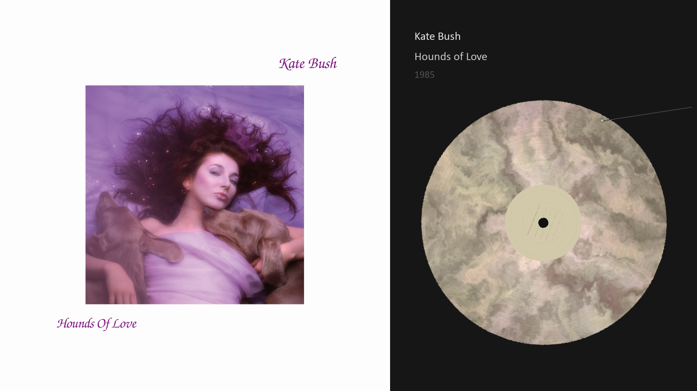
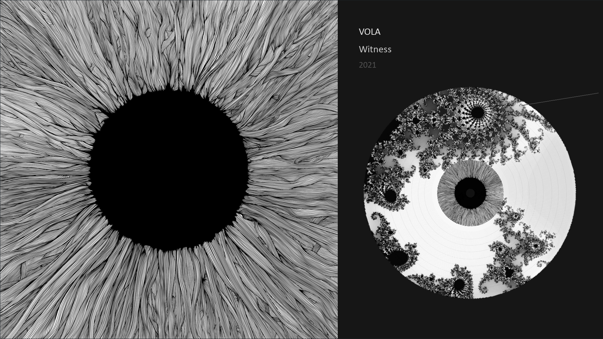

# lp



### Stop changing tracks, stop switching playlists, stop making playlists. Good bands already make 'em, they call them Albums. 

A music player that plays albums like records. Pygame renders a spinning vinyl on your display while a web UI lets you browse and control playback from your phone.

Grew up on Winamp. Simple player, but I still want my own style.

Touch-friendly web UI. Browse your library, tap an album, go.

LastFM scrobbling.



Only one layer deep. Albums — select one and it plays.



Colored vinyl, fractals, nebulae, label colors, brightness. Make it yours.



Subtle grooves in the vinyl mark each track on the album.



Tracks are accurately marked. The needle follows the grooves as it plays.



A sensible night.



Get into the right headspace.



\m/

## Setup

```bash
python -m venv .venv
source .venv/bin/activate
pip install -r requirements.txt
cp config.example.yml config.yml
# Edit config.yml with your music library path
python main.py
```

The web UI is at `http://localhost:8000`. The pygame display runs on whatever screen the process is on.

## Config

```yaml
music_library_path: /path/to/music  # Artist/Album folder structure
display:
  fullscreen: false
  width: 1920
  height: 1080
lastfm:
  api_key: ""      # Optional, for scrobbling
  api_secret: ""
```

## Features

- Album playback via libVLC
- Pygame vinyl visualization with spinning record, needle, and track grooves
- Web UI for browsing and playback control
- Vinyl styles: black, colored, clear, picture disc, Mandelbrot fractals, nebulae
- Customizable label colors
- Last.fm scrobbling (authenticate from the web UI)

## Architecture

Meant to run on a Raspberry Pi connected to a TV or other display. The web UI is your remote.

```
main.py          Entry point
lp/
  player.py      VLC playback engine
  display.py     Pygame vinyl renderer
  library.py     Music library scanner
  api.py         FastAPI REST server + static files
  scrobbler.py   Last.fm integration
static/          Web UI
```

### Just play the damn record.
