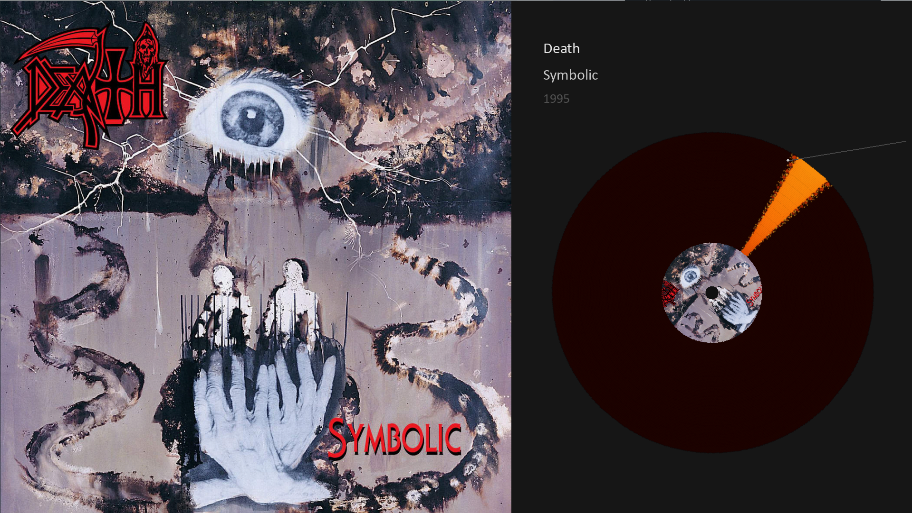

# lp

## Crucible & Ruin

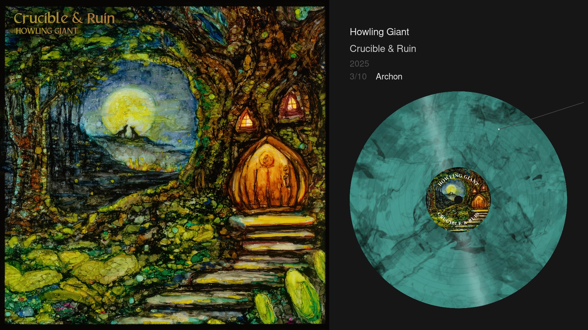


What lands in this release:

- **Teal-marble vinyl**: translucent teal smoke with dark veins running through it, the disc in the shot above.
- **Vinyl Effects**: finishes that go over any style (glass, deep edge, rim light), plus a choice of groove look (auto, shine, shadow or smooth), picked from the web UI.
- **The track**: the now-playing screen shows the track number and title under the year.
- **Better Scrobbling**: paused time no longer counts toward a scrobble, and scrobbles made while offline are kept and sent once Last.fm is reachable again.
- **Web UI enhancements** usability, features.
- **lp-deck and lp-studio**: the same engine now drives a desktop player (smart playlists, queue editing, media keys, tray) and a bench for designing vinyl styles, which is where teal-marble came from.

---

### Stop changing tracks, stop switching playlists, stop making playlists. Good bands already make 'em, they call them albums. 

A music player that plays albums like a record player plays albums. Pygame renders a spinning vinyl and the album art on your display while a web UI lets you browse and control playback from your phone.

Touch-friendly web UI. Browse your library, tap an album, melt.

LastFM scrobbling so you know how long you were faded last night.

Take screenshots, the next 3 were taken with the new feature. Also improved is the look of the grooves on all the patterns.  

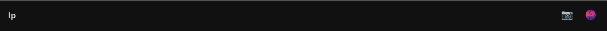

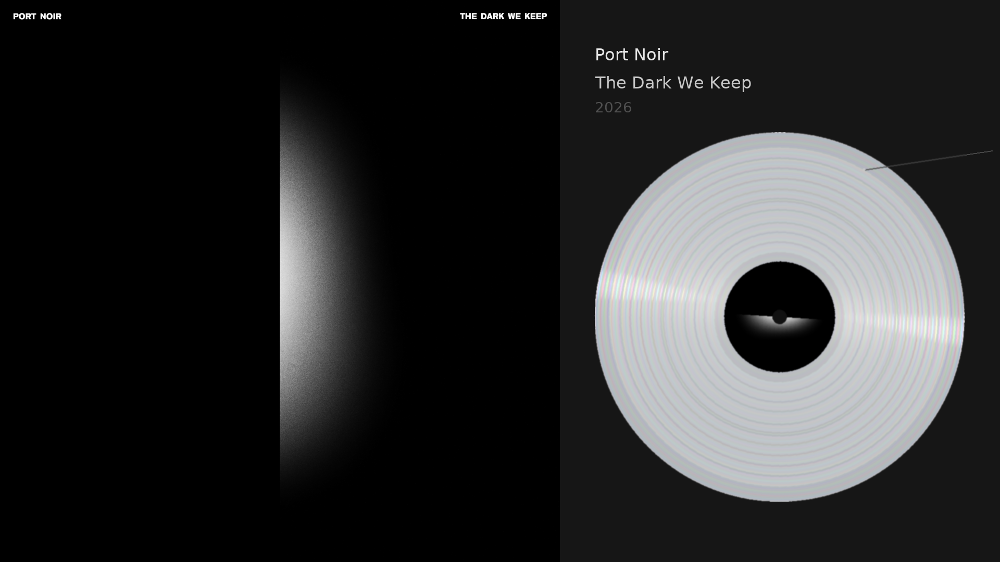

Better clear vinyl rendering with iridescent refraction and platter shimmer.

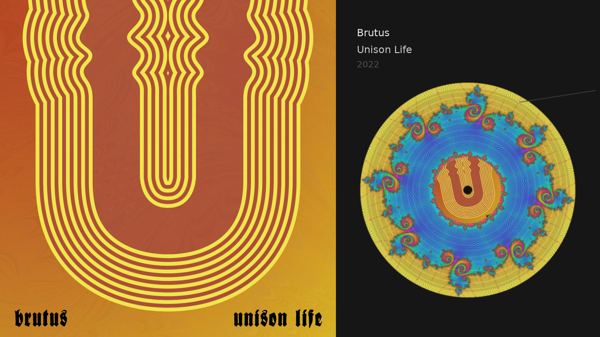

Ultra Deep-zoom Mandelbrot vinyls

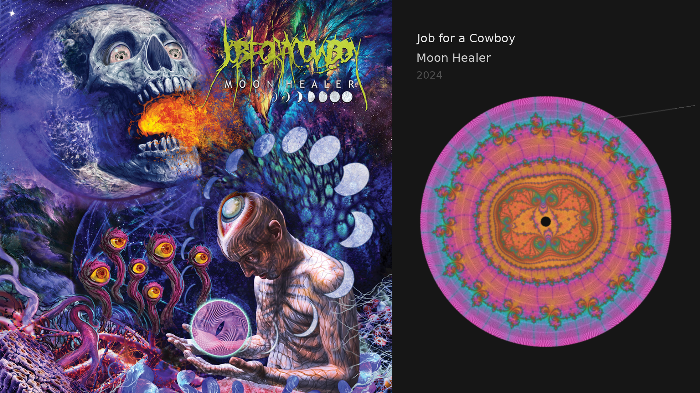

Use any fractal pattern as the full vinyl, just like Picture Discs

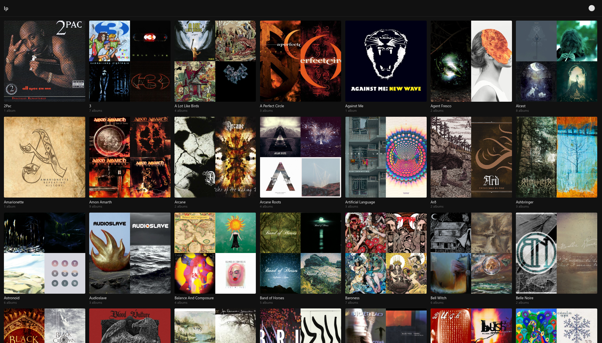

Only one layer deep. Albums — select one and it plays.

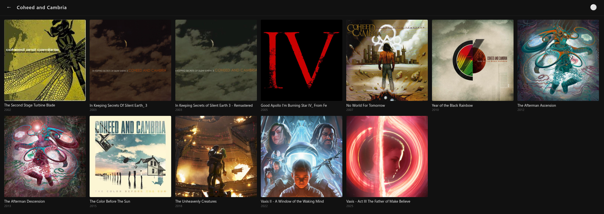

Colored vinyl, fractals, nebulae, label colors, brightness. Make it yours.

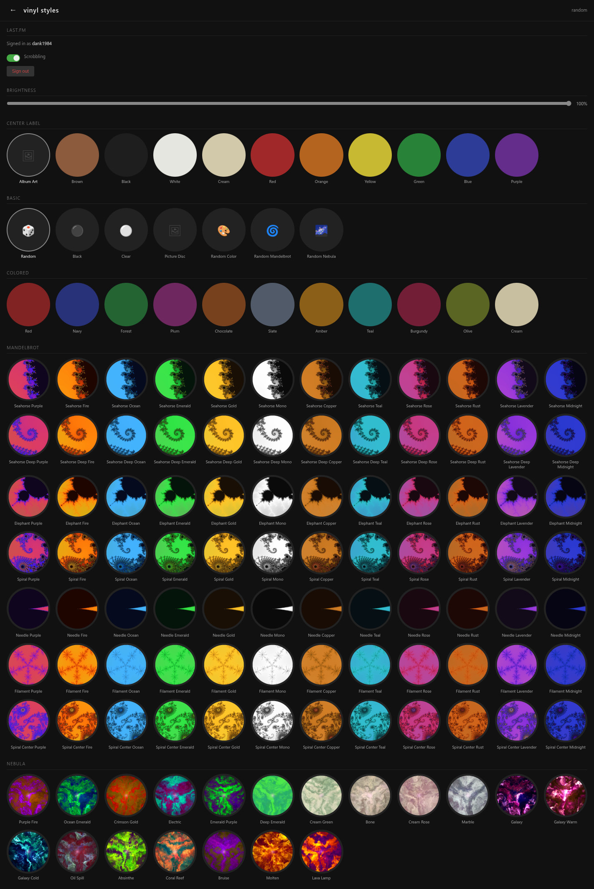

Subtle grooves in the vinyl mark each track on the album.

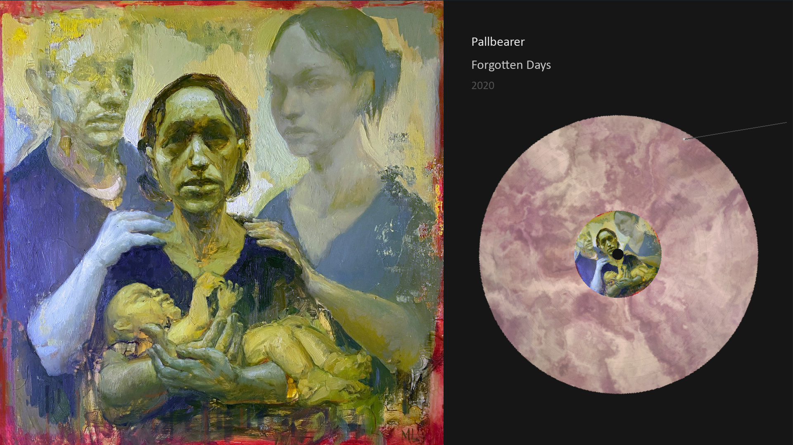

Tracks are accurately marked. The needle follows the grooves as it plays.

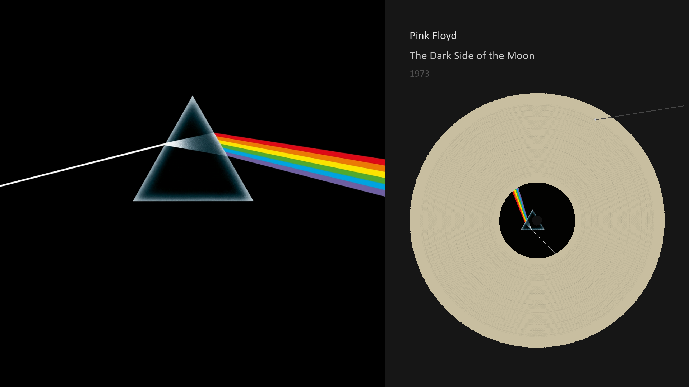

A sensible night.

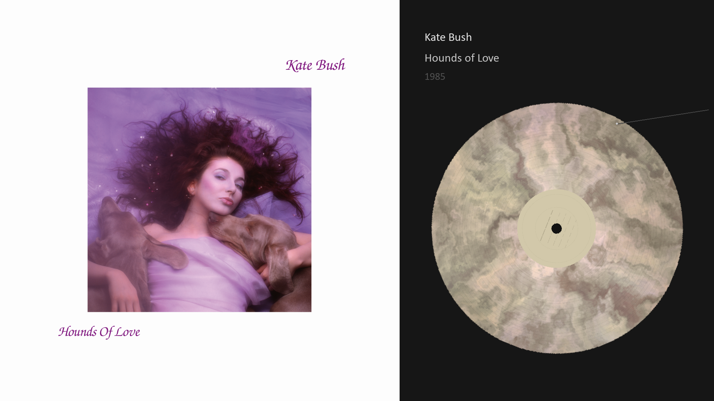

Get into the right headspace.

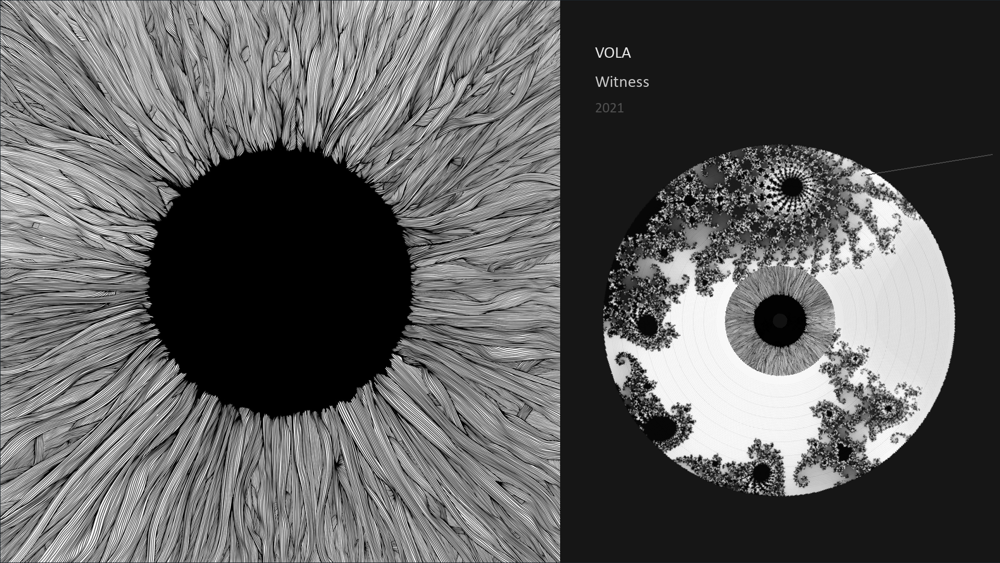

\m/

## Install

For a kiosk or a desktop that should just work, install from the latest release
and let it keep itself updated:

```bash
curl -fsSL https://raw.githubusercontent.com/dkoch84/lp/master/deploy/install.sh | bash -s -- --music /path/to/music
```

lp then checks GitHub for the next release every few hours and switches to it
once the album you are playing has finished; the web UI has **Check now** and
**Install now** too. Nothing runs as root. Details, the kiosk service, and the
release layout are in [deploy/DEPLOYMENT.md](deploy/DEPLOYMENT.md).

## The album as a video

```bash
make video ALBUM="/music/Howling Giant/2025 - Crucible & Ruin" OUT=crucible.mp4
```

Renders the whole album exactly as the kiosk plays it, vinyl spinning and the
needle tracking through the grooves, to a 1080p HEVC MP4 with the album's audio
joined gapless. Beside it lands a `.txt` with the YouTube description: a
timestamp per track, which YouTube turns into chapters. A free whole-album
visualizer for any band. `--preview 20` renders the first twenty seconds to
check the look; `--style`, `--effects` and the rest take the same values the
web picker does; `--codec h264` for players without HEVC. lp-deck has the same
thing as a **Video…** button on every album page. Needs ffmpeg.

## Setup (from a checkout)

```bash
python -m venv .venv
source .venv/bin/activate
pip install -r requirements.txt
cp config.example.yml config.yml
# Edit config.yml with your music library path
python main.py
```

The web UI is at `http://localhost:8000`. The pygame display runs on whatever screen the process is on.

## Config

```yaml
music_library_path: /path/to/music  # Artist/Album folder structure
display:
  fullscreen: false
  width: 1920
  height: 1080
lastfm:
  api_key: ""      # Optional, for scrobbling
  api_secret: ""
```

## Features

- Album playback via libVLC
- A record that is on is not cut off by a stray tap: the web UI asks, and "Play next" queues the album for when this one ends
- Recently played counts an album once a song of it has completed, so mis-taps never land on the shelf; anything there can be removed with its corner x
- Pygame vinyl visualization with spinning record, needle, and track grooves
- Web UI for browsing and playback control
- Vinyl styles: black, colored, clear, picture disc, Mandelbrot fractals, nebulae
- Customizable label colors
- Last.fm scrobbling (authenticate from the web UI)

## Architecture

Meant to run on a Raspberry Pi connected to a TV or other display. The web UI is your remote.

```
main.py          Entry point
lp/
  player.py      VLC playback engine
  display.py     Pygame vinyl renderer
  library.py     Music library scanner
  api.py         FastAPI REST server + static files
  scrobbler.py   Last.fm integration
static/          Web UI
```

### Just play the damn record.

## Vinyl styles

Random per album: black, colored, clear (with platter shimmer + iridescent
refraction), picture disc, pattern picture disc (fractal as the full
disc), and three fractal families:

- **Mandelbrot** — classic escape-time fractal at named zooms (seahorse,
  elephant, spiral, etc.) across a dozen color schemes.
- **Nebula** — value-noise gas clouds in 19 color variants.
- **Munafo Deep-Zoom** — `2.7×10⁻²²` deep-zoom Mandelbrot renders. The
  9000×9000 gold archives + the GPU/perturbation engine that produced
  them live in a separate repo: **[bongsweat](https://github.com/dkoch84/bongsweat)**. The
  vinyl-size cache (`lp/cache/munafo/*.png`, ~14 MB) is committed here
  and consumed at runtime by `_draw_munafo_vinyl()` in `lp/display.py`.

Center labels follow the same families — any fractal variant can be
chosen as the label.
