# lp

Plays albums like a record player plays albums. A spinning record on your screen, and your phone as the remote.

Stop changing tracks, stop switching playlists, stop making playlists. Good bands already make 'em, they call them albums.

Install, setup and everything else: [docs](docs/README.md).

## Crucible & Ruin

- **Teal-marble vinyl**: the one above.
- **Vinyl effects**: glass, deep edge and rim light, plus four groove looks.
- **Favorite styles**: star the ones you like, hide the rest.
- **Looks that stick**: your look survives a restart, and an album can keep its own.
- **Black background**: set the frame and panel colours yourself.
- **Track line**: the track number and title under the year.
- **Play next**: tap an album while one is on and lp asks first.
- **Recently played**: only counts an album once a song has finished.
- **Scrobbling**: paused time doesn't count, and offline scrobbles are sent later.
- **Updates itself**: installs a new release once the album you are playing ends. [Install](docs/install.md)
- **Album videos**: render a whole album as a video, with chapters for YouTube. [How](docs/album-video.md)
- **lp-deck** and **lp-studio**: see below.

## lp-deck

The same record on the desktop, in a full music player: playlists, search, a queue, lyrics, an equalizer and media keys.

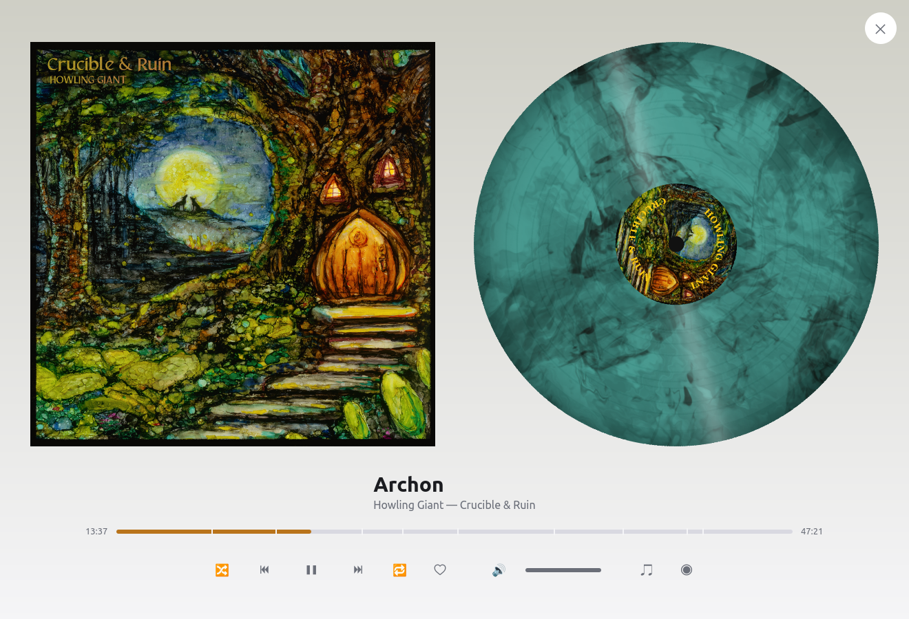

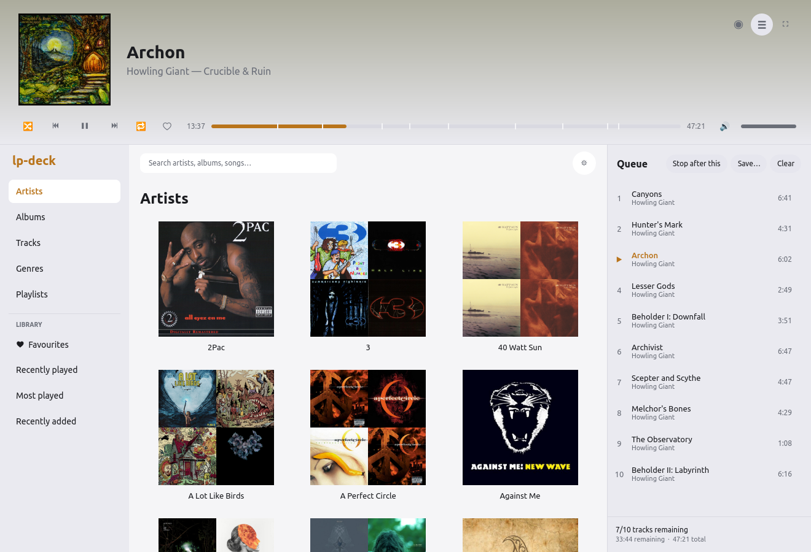

Pick a vinyl for one album, one artist, or everything.

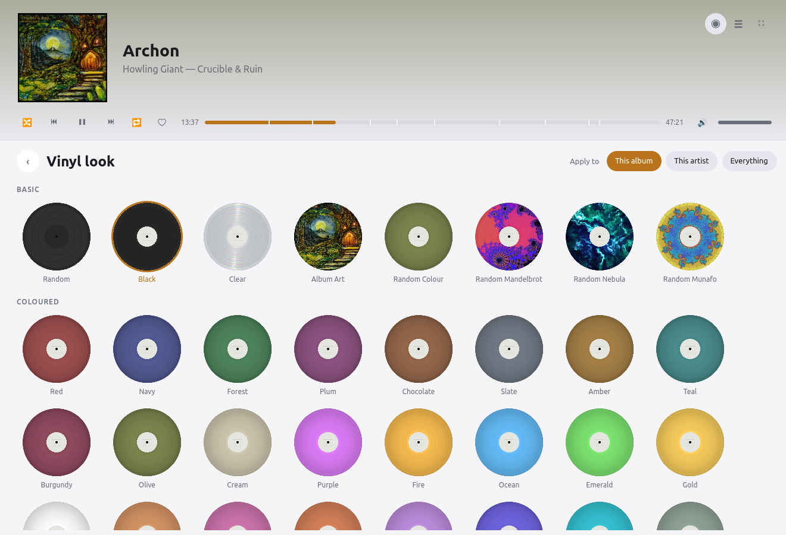

## lp-studio

Where vinyl styles are made. Move a slider, watch the record change. Teal-marble came from here.

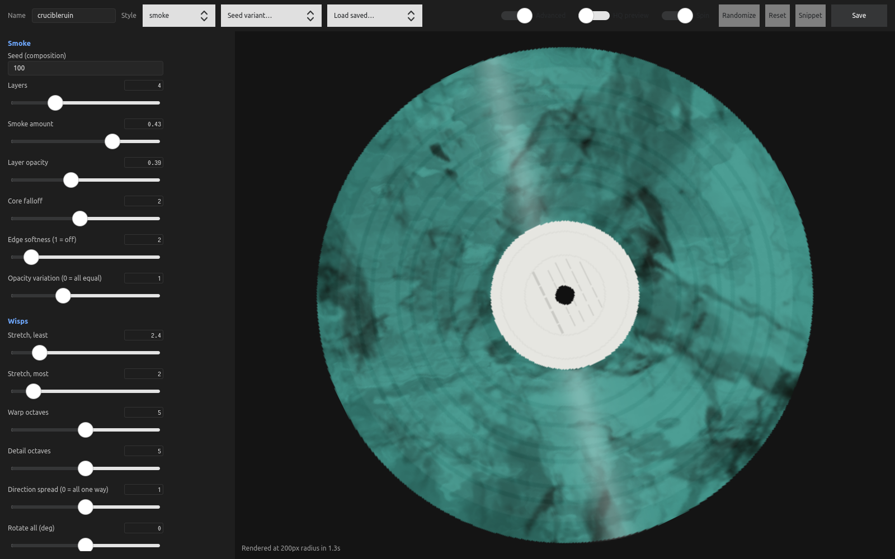

## The web UI

Your phone is the remote. Browse the library, tap an album, it plays.

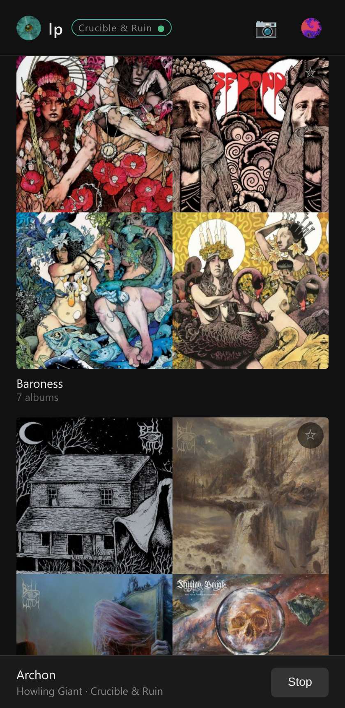

### Play next

When a record is on, lp asks before cutting it off. Play next puts the album in the queue.

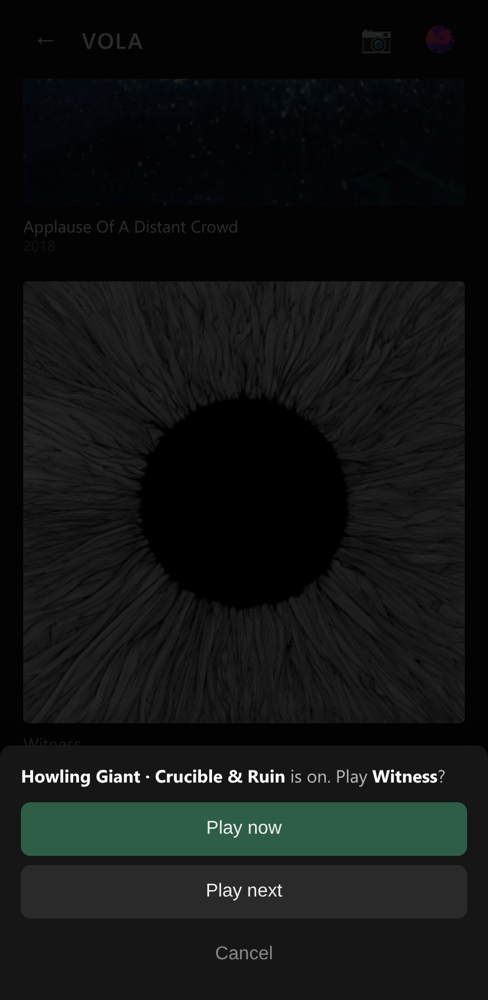 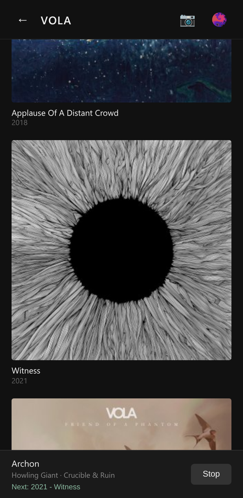 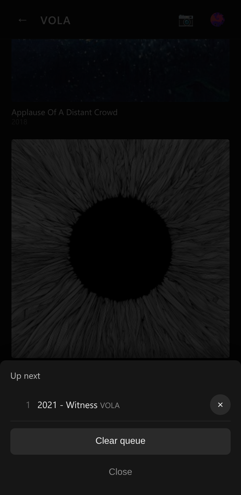

### Updates

Tap the release name to see what you have. Install a new one now, or after this album.

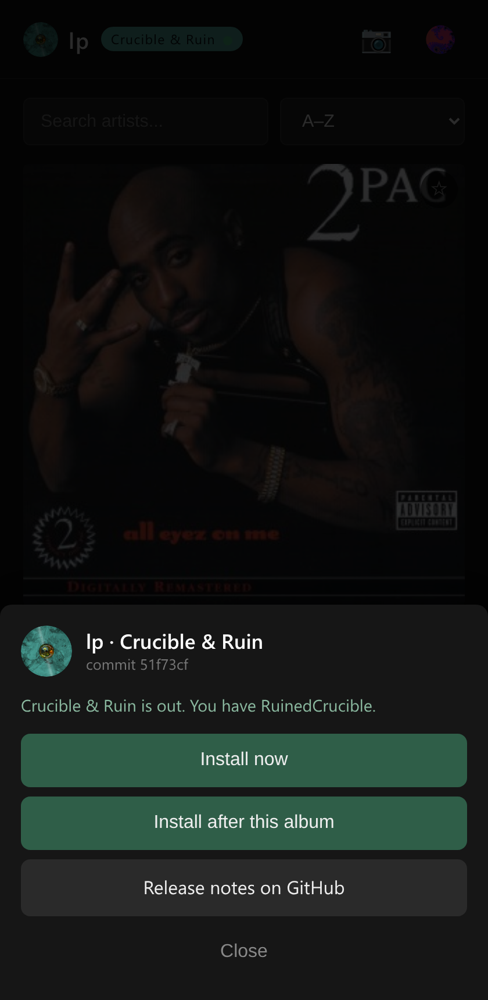

### Looks and favorites

Change the vinyl for every album, or just the one playing. Star the styles you like and show only those.

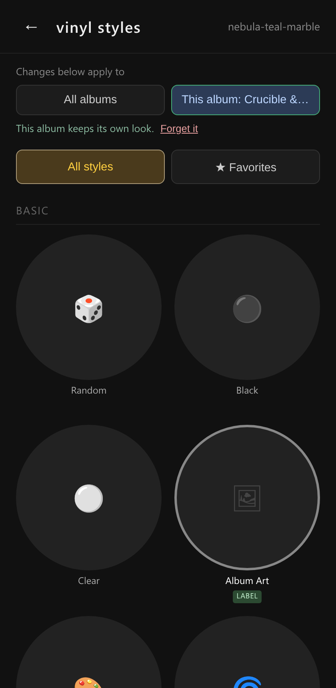 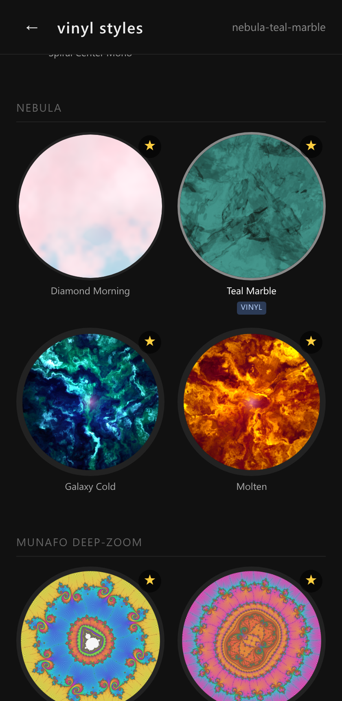

## On the kiosk

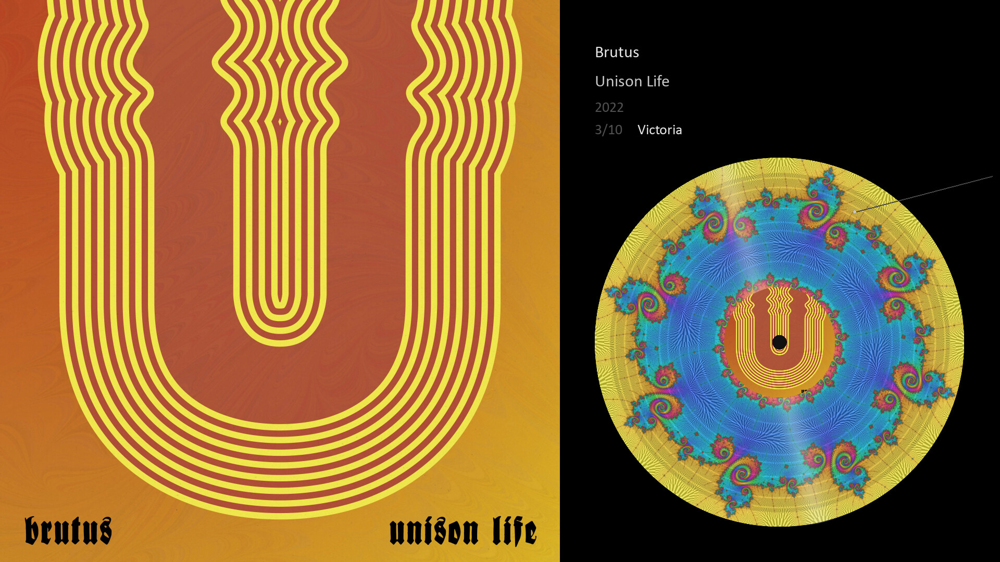

Brutus, *Unison Life*: Munafo deep zoom.

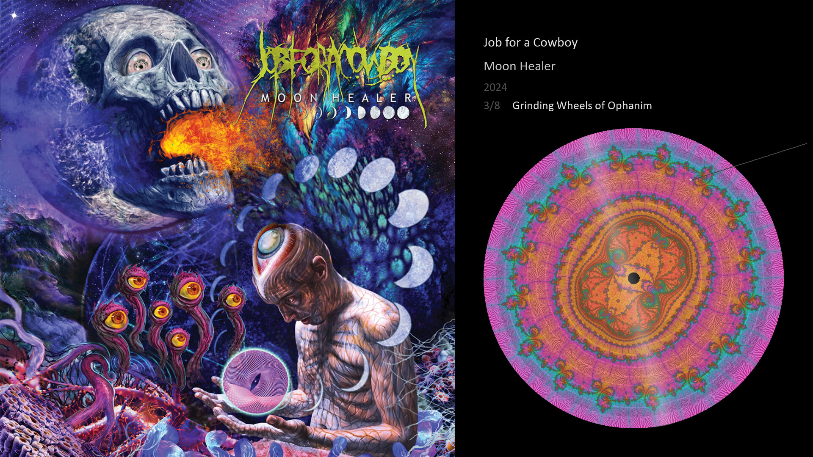

Job for a Cowboy, *Moon Healer*: Munafo as a picture disc.

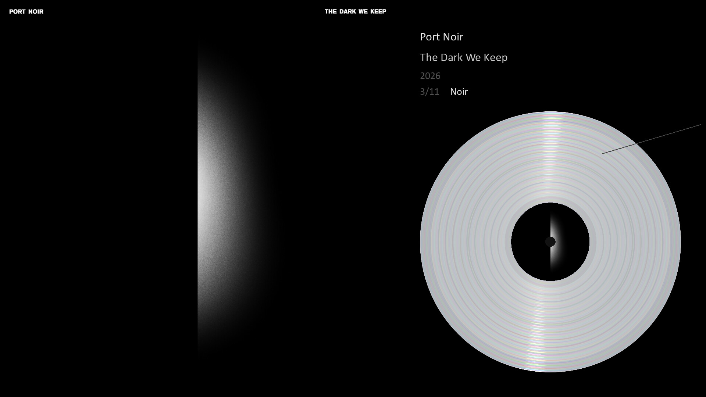

Port Noir, *The Dark We Keep*: clear vinyl.

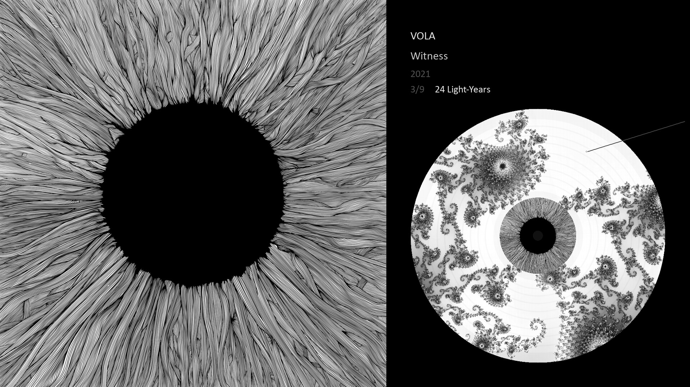

VOLA, *Witness*: Mandelbrot.

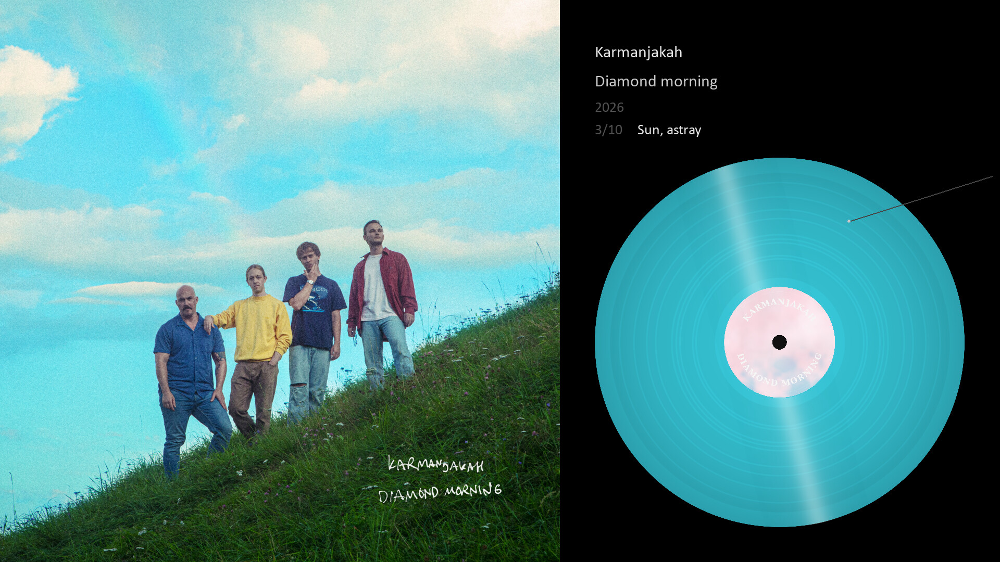

Karmanjakah, *Diamond morning*: cyan, with a cloud label.
